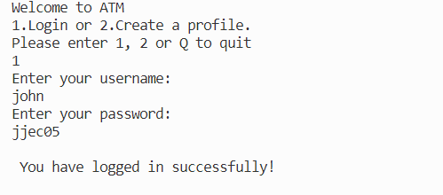
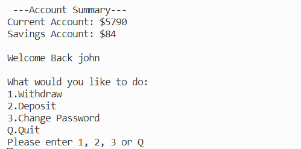
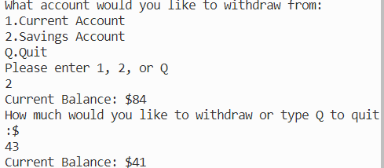

# Python ATM
Python ATM  is a Python terminal system, which runs in the Code Institute mock terminal on Heroku.

Users have the ability to create a bank account in the ATM, update their account details, withdraw and deposit money and the accounts being updated in real time.
## How to use
The ATM has simply controls and interface. The user will be promted to enter a number depending on what they action they would like to carry. They can enter Q at anytime to quit the system.

## Features
### Exisiting Features
- User authentication

- Real time account summary

- Real Time account updates

- Account setup
- Input validation and error checking
- Balance checking. Account is not able to go into negative digits

- Data for user profiles is maintained in an class instance

### Future Features
- Allow users to see past transactions

## Data Model
I used the currentuser class as my model. The class currentuser stores the current user's password, the current balance of their current account and the current balance of their savings account

## Testing
I have manually tested this project by doing the following:
- Passed the code through a PEP8 linter and confirmed there are no problems
- Given invalid inputs: strings when numbers are expected, negative values, non-integers, withdraw more than there is in the account, usernames that are already choosen other users and invalid passwords

# Bugs
## Solved Bugs
- When i entered a string when withdrawing or depositing money, the program would crash. i fixed this by adding data validation function to the input.
- When the program asks to choose one of the options on the screen and the user enters an option not listed, the program would crash. I fixed this by adding a while loop to to only accept the options displayed
- As i got more comfortable with github, I started to use the issues tab to track bugs: https://github.com/jcurran1289/PP3-atm/issues?q=is%3Aissue+is%3Aclosed

### Validator Testing
- PEP8
-- No errors were returned  from PEP8online.com

### Testing Welcome Screen
- [x] entry outside range, says invalid entry and reprompts
- [x] no entry, says invalid entry and reprompts
- [x] alpha when numeric expected, says invalid entry and reprompts
- [x] valid entry with leading spaces, trimmed and shows proper next stage
- [x] valid entry with trailing spaces, trimmed and shows proper next stage
- [x] enters lower case q, proceeds as expected
- [x] enters upper case q, proceeds as expected

### Testing Login Username Screen
- [x] a username that does not exist, says username not found and goes back to welcome screen
- [x] no entry, says username not found and goes back to welcome screen
- [x] enters lower case username, proceeds as expected
- [x] enters upper case username, proceeds as expected
- [x] valid entry with leading spaces, says username not found and goes back to welcome screen
- [x] valid entry with trailing spaces, says username not found and goes back to welcome screen
- [x] enters lower case q, says username not found and goes back to welcome screen
- [x] enters upper case q, says username not found and goes back to welcome screen

### Testing Login password Screen
- [x] incorrect password, incorrect password and reprompts
- [x] no entry, incorrect password and reprompts
- [x] valid entry with leading spaces, incorrect password and reprompts
- [x] valid entry with trailing spaces, incorrect password and reprompts
- [x] enters lower case q, goes back to welcome screen
- [x] enters upper case q, goes back to welcome screen

### Testing Account Summary Screen
- [x] entry outside range, says sorry and repropts
- [x] no entry, says sorry and reprompts
- [x] alpha when numeric expected, sorry and reprompts
- [x] valid entry with leading spaces, trimmed and shows proper next stage
- [x] valid entry with trailing spaces, trimmed and shows proper next stage
- [x] enters lower case q, proceeds as expected
- [x] enters upper case q, proceeds as expected

### Testing Withdraw Current & Savings Account Screen
- [x] no entry, says invalid entry and reprompts
- [x] alpha when numeric expected, says invalid entry and reprompts
- [x] valid entry with leading spaces, trimmed and shows proper next stage
- [x] valid entry with trailing spaces, trimmed and shows proper next stage
- [x] enters lower case q, proceeds as expected
- [x] enters upper case q, proceeds as expected
- [x] enters number bigger than account current balance, says insufficient funds and reprompts
- [x] enters enters negative or decimal numbers, says invalid entry and reprompts

### Testing Deposit Current & Savings Account Screen
- [x] no entry, says invalid entry and reprompts
- [x] alpha when numeric expected, says invalid entry and reprompts
- [x] valid entry with leading spaces, trimmed and shows proper next stage
- [x] valid entry with trailing spaces, trimmed and shows proper next stage
- [x] enters lower case q, proceeds as expected
- [x] enters upper case q, proceeds as expected
- [x] enters enters negative or decimal numbers, says invalid entry and reprompts

### Testing Change Password Screen
- [x] no entry, says password must be 6 characters long and reprompts
- [x]  entry less than 6 characters long, says password must be 6 characters long and reprompts
- [x] enters lower case q, proceeds as expected
- [x] enters upper case q, proceeds as expected

### Testing Create a profile Screen
- [x] no entry for username, says username must be at least 2 characters and reprompts
- [x] no entry for password, says username must be at least 6 characters and reprompts
- [x] no entry for current account amount, says invalid entry and reprompts
- [x] no entry for savings account amount, says invalid entry and reprompts
- [x] enters lower case q, proceeds as expected
- [x] enters upper case q, proceeds as expected

### Version Control
I used github to track my code. Initially was commiting huge chunks and many changes at once. Then started to do smaller changes one at a time

## Requirements
In order to run this project properly you will need the following:
- Import gspread library
- Connect the program to your google drive
- Create a google drive spreahsheet called "profiles" with the following columns:
  - Username	
  - password	
  - current account	
  - savings account

## Deployment
This project was deployed using Code Institute's mock terminal for Heroku.
The steps for deployment are as follows:
- Fork or clone this repository
- Create a new Heroku app
- Set the buildpacks to Python and NodeJS in that order
- Link the Heroku app to the repository
- Click on Deploy
## Credits
- Code institute for deployment terminal
- Code institute love-sandwichs project for the data validation